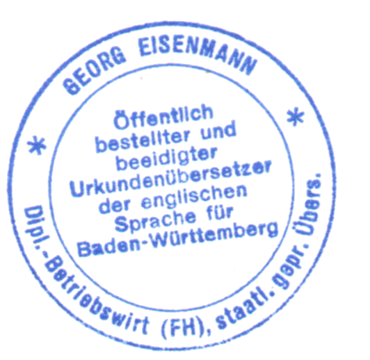

# Hintergrundinformationen zum Übersetzungsbüro
Eisenmann Übersetzungsteam wurde 1990 von Suzanne Eisenmann in Pforzheim gegründet. 1996 erfolgte der Umzug nach Karlsruhe.

**Suzanne Eisenmann** ist Engländerin. Sie arbeitete nach ihrem Studium (Deutsch mit Wirtschaft und Politik) an der Southbank University in London sowie an der Universität Madrid  zunächst als Lehrerin für Englisch (Wirtschaftsenglisch) und Übersetzerin bei einer Sprachschule und später zwei Jahre bei einem englischen Fachverlag als Redakteurin. Frau Eisenmann ist seit 1990 Übersetzerin für ausschließlich Deutsch - Englisch mit Schwerpunkt im Bereich Recht (Verträge), Patentwesen, Wirtschaft und Medizin und erstellt juristische Englisch-Übersetzungen.

**Georg Eisenmann** ist Deutscher. Er studierte nach dem Gymnasium in Freiburg und Wehrdienst bei Freiburg Betriebswirtschaft (Marketing und Export) an der Fachhochschule für Wirtschaft Pforzheim. Nach seinem Wirtschaftsabschluß als Diplom-Betriebswirt und einem längeren England-Aufenthalt (London) arbeitete er zwei Jahre verantwortlich im Produktmanagement in der Medizintechnik. Zusätzlich als staatlich geprüfter Übersetzer und beeidigter Übersetzer qualifiziert, erstellt Georg Eisenmann als Englisch-Übersetzer in Karlsruhe seit 1991 ausschließlich englische Übersetzungen (Richtung Englisch - Deutsch) mit Schwerpunkt im Bereich Recht (Verträge) , Patente, Wirtschaft, Medizin und Medizintechnik sowie beglaubigte Übersetzungen.

Mitgliedschaften in Übersetzer-Berufsverbänden und Akkreditierungen
- BDÜ  (Bundesverband für Dolmetscher und Übersetzer, Suzanne und Georg Eisenmann)
- Vereidigt am Landgericht Karlsruhe (Georg Eisenmann)
- Akkreditiert als Übersetzer für Englisch beim amerikanischen Generalkonsulat in Frankfurt
- Akkreditiert als Übersetzer für Englisch beim britischen Konsulat in Frankfurt
- Akkreditiert als Übersetzer für Englisch beim britischen Generalkonsulat in Stuttgart

### Für Übersetzungen eingesetzte Software
- Microsoft Office(Word, Excel, PowerPoint, Access, V. 2003 / 2007 / 2010)
- PageMaker
- FrameMaker
- QuarkXPress
- Dreamweaver
- Trados - Übersetzer-Software, sowie SDLX, OmegaT

Startseite

#### Eisenmann Übersetzungen in Karlsruhe, seit 1990 als Deutsch-Englisch-Übersetzer tätig.

## Übersetzungsbüro Eisenmann in Karlsruhe
Das Übersetzungsbüro Eisenmann für Englisch und Technik wurde im Juni 1990 von Suzanne Eisenmann in Pforzheim gegründet. Der Umzug aus Pforzheim ins benachbarte Karlsruhe erfolgte 1996.

## Inhaberin Übersetzungsbüro
Inhaberin des Übersetzungsbüros ist Suzanne C. Eisenmann. Nach ihrem sehr erfolgreich bestanden Deutschstudium an der Londoner Southbank University war die Engländerin als Englischlehrerin und Übersetzerin bei der Inlingua Sprachschule in Pforzheim tätig und später 2 Jahre bei einer englischen  Fachzeitschrift für Wirtschaft und Technologie. Seit der Gründung des Übersetzungsbüros in Pforzheim im Jahre 1990 übersetzt Suzanne C. Eisenmann ausschließlich in die englische Sprache, ihre Muttersprache.

## Leiter Übersetzungsbüro
Das Übersetzungsbüro wird von Georg Eisenmann geführt. Er studierte BWL an der Hochschule Pforzheim mit Abschluß Diplom-Betriebswirt FH. Nach Studium und Arbeit in England, wo seine Frau Deutsch studierte, arbeitete er verantwortlich im technischen Produktmanagement in der Medizintechnik in Karlsruhe, wo er unter anderem Gebrauchsanleitungen für medizinische Produkte übersetzte. Georg Eisenmann ist seit 1991 staatlich geprüfter Übersetzer (und auch beeidigter Übersetzer) für Englisch und leitet seitdem das Übersetzungsbüro in Pforzheim bzw. Karlsruhe.

### Berufsverbände für Übersetzer, Vereidigung
- Suzanne und Georg Eisenmann sind beide BDÜ-Mitglied (Bundesverband für Dolmetscher und Übersetzer, größter Berufsverband für Übersetzer in Europa).
- Georg Eisenmann ist für englische Übersetzungen vereidigt am Landgericht Karlsruhe sowie akkreditiert beim amerikanischen Generalkonsulat in Frankfurt und beim britischen Konsulat in Frankfurt sowie gemeldet beim Medical Council, Irland.

Erfahren Sie mehr über den Übersetzer-Alltag in unserem Übersetzer-Blog.

Weitere Englisch-Übersetzer aus unserem Team

