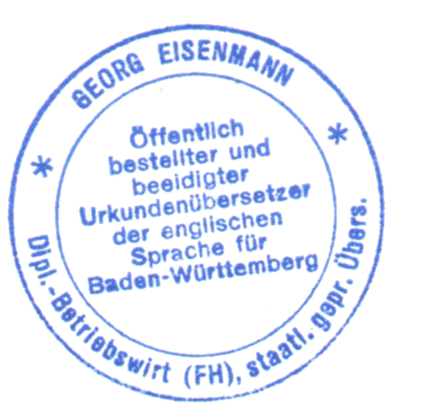

## Background Information
Eisenmann Übersetzungsteam was founded in 1990 by Suzanne Eisenmann.

**Suzanne Eisenmann** is English. After her studies at Southbank University in London (German with Economics and Politics), she worked first as an English teacher (business English) and translator in a language school, then as an editor in an English specialist publishing house two years later. Since 1990, Suzanne Eisenmann has been a German-to-English translator focusing on law (contracts), patent systems, economics and medicine.

**Georg Eisenmann** is German. After attending the Gymnasium in Freiburg and completing his military service, he studied Business Administration (Marketing and Exports) at the Pforzheim Academy of Economics. After graduating as a business economist and spending a long time in Britain (London), he worked for two years in product management in medical technology. Also a state-certified and sworn translator, since 1991 Georg Eisenmann has translated from English to German, with a focus on law (contracts), patents, economics, medicine, medical technology and certified translations.

### Memberships in Professional Associations and Misc.
- BDÜ [German Association of Interpreters and Translators] (Suzanne & Georg Eisenmann)
- Sworn in at the Regional Court of Karlsruhe (Georg Eisenmann)
- Accredited as a translator for English at the American Consulate General in Frankfurt
- Accredited as a translator for English at the British Consulate General in Munich

### Software Used
- Microsoft Office(Word, Excel, PowerPoint, Access)
- PageMaker
- FrameMaker
- QuarkXPress
- Dreamweaver
- Trados

## The BDÜ - The Federal Association of Interpreters and Translators
Suzanne Eisenmann has been a member of the BDÜ since 1991, as a translator of English with a university degree from London.

Georg Eisenmann has been a member of the BDÜ since 2011, as a state-certified and sworn translator of English at the Regional Court of Karlsruhe.

With over 7,000 translators and interpreters, the BDÜ is by far the largest association of translators in Germany and one of the largest in the world. The American ATA (American Translators Association) is larger, with 10,000 linguists.

The BDÜ is organised into state associations, and membership offers a diverse range of benefits alongside seminars for translators. Every two years the BDÜ convention is held in Berlin, at the same time providing translation graduates with a career platform.

## Certified Translations
Translations must be certified when used for official purposes, both domestically and abroad. Almost every divorce decree, birth certificate, certificate of registration, partnership agreement or balance sheet which is translated must also be certified by the translator. In the business sphere, a certified translation would be required, for instance, when opening a new branch or taking over a company. In the private sphere, for example, documents necessary for a wedding are officially recognised.

By certifying, the sworn and/or publicly appointed translator confirms that the translation is correct with a certification notice, his/her signature and often a stamp.

When presented abroad, the translator’s certification often must be authenticated by a notary, whose authentication must then be legalised by the regional court. We also offer this service.

Certified translations in Germany may only be completed by translators who have been appointed, authorised and sworn in accordingly by the respective regional court. A translator may only apply to be sworn in if he/she has passed a state examination as a translator in the language in question, or if he/she has a university-level degree in Translation Studies.

Georg Eisenmann is accredited as a publicly appointed and sworn translator for English and German (Regional Court of Karlsruhe) at the American Consulate General in Frankfurt and the British Consulate General in Munich.

